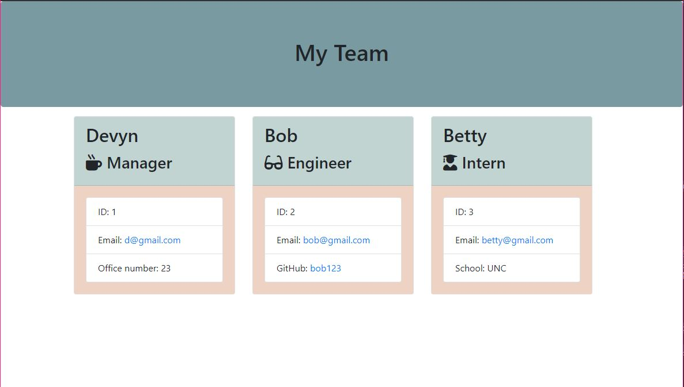

# team_summary

## Discription:

A command line application that allows a user to input employee information to generate a team roster that includes emails and GitHub user names. The application uses Node.js, including the modules jest for testing and inquirer for running question prompts.

## Table of Contents

- [Installation](#installation)
- [Usage](#usage)
- [Test](#test)
- [Screenshot](#screenshot)
- [Skills](#skills)
- [License](#license)

## Installation

User will need a code editing software that you can run a terminal through and will need to pull down the code. User must also use npm install to download the Node json package and modules.

## Usage

Load the application in vs code or some other code editor that has a terminal. Within the terminal use 'node app.js' to run the application.

## Test

Jest - to run use 'npm test'

## Screenshot

## Skills

## License

License Documentation: (https://opensource.org/licenses/AFL-3.0)

## Resources
* Tutor - Jesse Schimal
* Class activities
* GitHub docs
